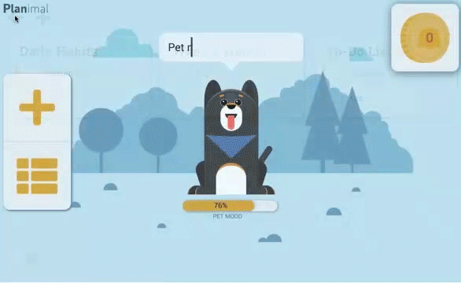
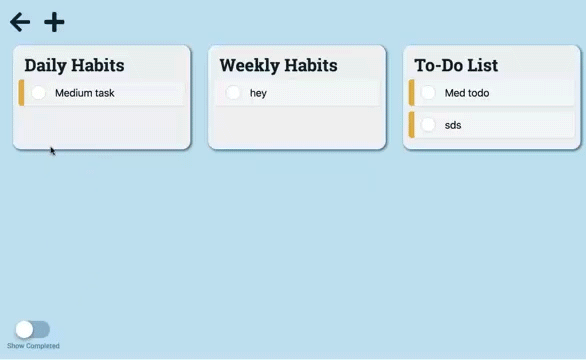

# planimals-reward-based-todo-list-app

A reward based todo app with a digital pet you must keep happy by completing your tasks.

Task: Create a database to build an app to display and manipulate the data in a meaningful way.

- On logging in you name your pet
- You have three options on the home page, add a task, view tasks, or look at shopping inventory
- You are rewarded currency based on task importance
- You can buy toys for your pet with your currency
- Your pets mood directly correlates with the ratio of tasks completed and tasks open
- You can add, edit, or delete a task
- You can toggle between seeing completed and uncompleted tasks

